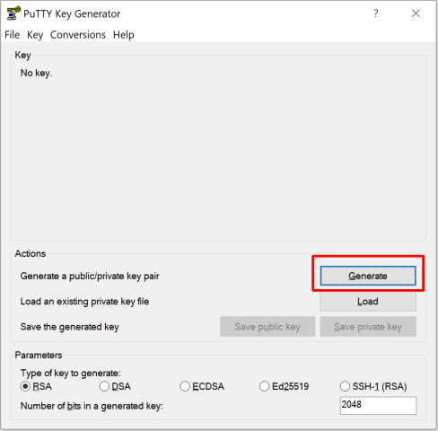
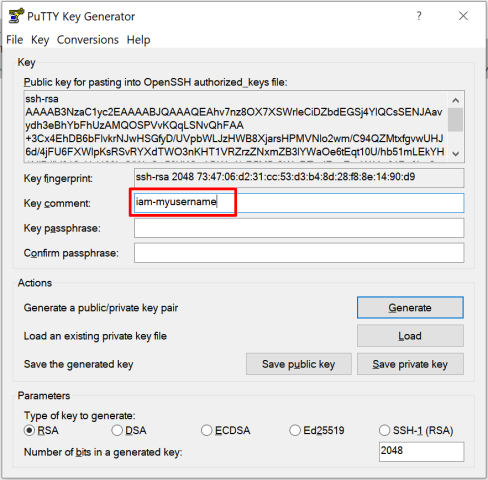
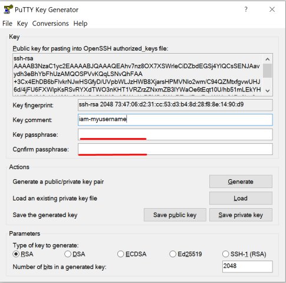
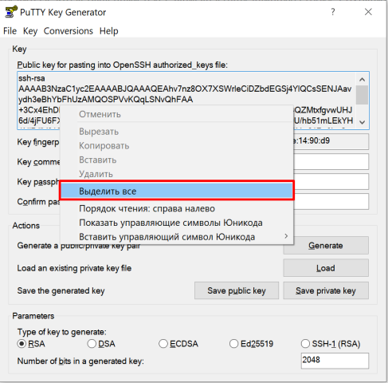
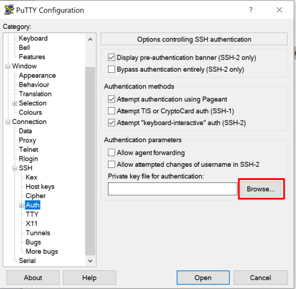
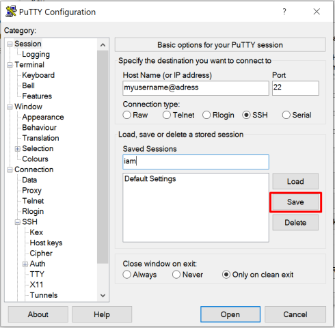
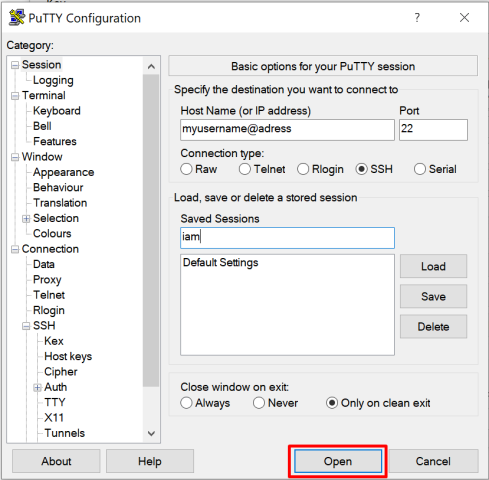

# Как сгенерировать открытый и закрытый ключ SSH для работы с суперкомпьютером ИПМ ДВО РАН

Дана общая инструкция по работе с SSH ключами, которая работает для любого сервера с подключением SSH.
Если у вас уже есть ключ, можно использовать его, не генерируя новый. 
В этом случае для Windows пропустите пункты генерации ключа, выполнив вместо них загрузку готового файла `.ppk` в программу `putty-keygen` (п.8 и далее), а для Linux или MacOS - просто используйте готовый открытый ключ.

## Для систем MS Windows

1. Установите программу `puttygen` (входит в состав `putty` и `WinSCP`)
2. Запустите программу `puttygen`, нажмите кнопку "Generate" (рис. 1)\
\
Рисунок 1.
3. Двигайте мышью над пустым полем окна программы, пока полоса прогресса вверху не дойдёт до конца
4. Мы рекомендуем изменить комментарий ключа для того, чтобы всегда идентифицировать ключ (рис. 2). Этот шаг необязателен. Не используйте русских букв. Рекомендуемый текст комментария: `iam-username`, где `username` — предпочтительное имя Вашей учётной записи на кластере. Формат может быть другим, это не принципиально.\
\
Рисунок 2.
5. Придумайте и введите пароль ключа в поля "Key passphrase" и "Confirm passphrase" (рис. 3)\
\
Рисунок 3.
6. Сохраните закрытую (приватную) часть ключа. Лучше всего сохранить его на сменный flash-накопитель. Ни в коем случае не сохраняйте его на рабочий стол или в папку "Мои документы" - этот файл не должен попасть в чужие руки. Для сохранения нажмите кнопку "Save private key".
7. Теперь необходимо сохранить открытую (публичную) часть ключа. Этот файл может быть доступен любому человеку. Для сохранения выделите всё текстовое поле "Public key for passing..." (рис 4). Затем нажмите Ctrl+C или в контекстном меню над этим же полем выберите "Копировать". Откройте текстовый редактор (желательно Notepad), выберите в меню "Редактировать/вставить". Убедитесь, что вставленный текст записан в одну длинную строку. Сохраните полученный файл в любое удобное Вам место на компьютере.\
**ВНИМАНИЕ! Сохраняйте файл в текстовом формате (txt), ни в коем случае не в формате редактора (doc, docx, odt, и т.п.).**\
\
Рисунок 4.
8. Теперь для доступа на суперкомпьютер Вам необходимо указать **закрытый** ключ в настройках клиента `ssh`. Продемонстрируем на примере `putty`. Запустите программу. Перейдите в категорию "Connection/SSH/Auth" и нажмите кнопку "Browse" (Рис. 5). Выберите файл с закрытым ключом. 
\
Рисунок 5.
9. Вернитесь в категорию "Session", в поле "Host Name" укажите свой логин, затем символ `@` и адрес суперкомпьютера (Рис. 6). Для ускорения последующих входов, в поле "Saved sessions" введите имя сессии, например "iam", и нажмите кнопку "Save" (Рис. 6).
\
Рисунок 6.
10. Этот пункт опционален, но может помочь предотвратить пробемы с отображением русских букв и оформления программ типа `mc`. Перейдите на вкладку Window/Translation, в списке Remote character set выберитет UTF-8. Вернитесь на вкладку Session и нажмите Save.
11. Теперь можно нажать кнопку "Open", ввести имя пользователя (если не указано в адресе сервера) после появившегося приглашения, и пароль к Вашему ключу (если ключ создан с паролем). При новом входе, выберите пункт "iam" в списке сохранённых сессий и нажмите "Load", а затем "Open".
\
Рисунок 7.
12. Открытый ключ теперь можно прислать администратору кластера для создания (или обновления) учетной записи.

## Для систем Linux/UNIX/MacOS

1. Данная инструкция приведена для OpenSSH. Для других реализаций, вам необходимо сгенерировать пару ключей (открытый/закрытый) средствами установленной реализации и сконвертировать открытый ключ в формат OpenSSH. Затем, перейдите к п. 5 данной инструкции.
2. Далее везде предполагаем, что Ваш логин на суперкомпьютере user1, а имя файла для ключа - iam. Имя файла вы можете выбрать самостоятельно.
3. На своём компьютере (не на суперкомпьютере) запустите команду `ssh-keygen -t rsa -b 2048 -C 'iam-user1' -f ~/.ssh/iam`. Здесь `~/.ssh/iam` - путь к файлу ключа, каталог `~/.ssh` менять не нужно. `iam-user1` - просто комментарий, который останется в тексте ключа, по нему будет легко различить тексты разных ключей. Программа предложит ввести пароль на ключ (pass phrase) - дважды введите одинаковый пароль. Не забывайте его - восстановить пароль невозможно. Пароль можно не вводить, но тогда любой обладатель файлом с ключом сможет подключиться к кластеру от Вашего имени.
4. Если команда отработала успешно, будут созданы два файла - `~/.ssh/iam` - закрытый ключ и `~/.ssh/iam.pub` - открытый.
5. Если вы планируете входить на кластер не только с того компьютера, на котором сгенерирован ключ, то скопируйте файл `~/.ssh/iam` на сменный накопитель и перенесите на те компьютеры, откуда Вы планируете входить. Обратите внимание на то, что после переноса необходимо сменить права на файл ключа - он не должен быть доступен на чтение или запись группе и другим пользователям. Воспользуйтесь после переноса командой `chmod 600 ~/.ssh/mgu` (Linux/UNIX/MacOS).
6. Для входа ни суперкомпьютер Вы можете использовать строку: `ssh -i ~/.ssh/iam user1@adress`.
7. Для упрощения входа можно настроить Ваш ssh-клиент. Для этого добавьте в файл `~/.ssh/config` строки (если его нет, содайте его):
```
Host iam
	HostName adress
	User user1
	IdentityFile ~/.ssh/iam
```

Теперь, после регистрации (если Вы не были ранее зарегистрированы), Вы сможете входить на кластер командой `ssh iam`. После соединения с кластером, Вам будет необходимо ввести пароль ключа (если он был указан при создании ключа).