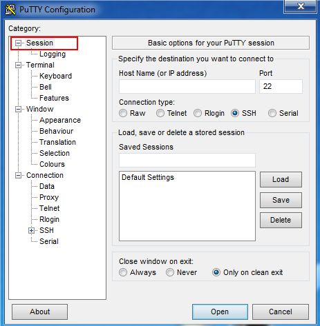
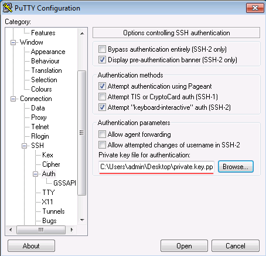

# Пользовательская инструкция кластера Geron (ИПМ ДВО РАН)

*Версия 0.1.*

<!-- MarkdownTOC autolink="true" autoanchor="true" -->

- [Общие характеристики:](#%D0%9E%D0%B1%D1%89%D0%B8%D0%B5-%D1%85%D0%B0%D1%80%D0%B0%D0%BA%D1%82%D0%B5%D1%80%D0%B8%D1%81%D1%82%D0%B8%D0%BA%D0%B8)
- [Правила работы на кластере:](#%D0%9F%D1%80%D0%B0%D0%B2%D0%B8%D0%BB%D0%B0-%D1%80%D0%B0%D0%B1%D0%BE%D1%82%D1%8B-%D0%BD%D0%B0-%D0%BA%D0%BB%D0%B0%D1%81%D1%82%D0%B5%D1%80%D0%B5)
	- [Пользователю разрешается:](#%D0%9F%D0%BE%D0%BB%D1%8C%D0%B7%D0%BE%D0%B2%D0%B0%D1%82%D0%B5%D0%BB%D1%8E-%D1%80%D0%B0%D0%B7%D1%80%D0%B5%D1%88%D0%B0%D0%B5%D1%82%D1%81%D1%8F)
	- [Пользователю запрещается:](#%D0%9F%D0%BE%D0%BB%D1%8C%D0%B7%D0%BE%D0%B2%D0%B0%D1%82%D0%B5%D0%BB%D1%8E-%D0%B7%D0%B0%D0%BF%D1%80%D0%B5%D1%89%D0%B0%D0%B5%D1%82%D1%81%D1%8F)
- [Учетные записи](#%D0%A3%D1%87%D0%B5%D1%82%D0%BD%D1%8B%D0%B5-%D0%B7%D0%B0%D0%BF%D0%B8%D1%81%D0%B8)
	- [Регистрация учетной записи](#%D0%A0%D0%B5%D0%B3%D0%B8%D1%81%D1%82%D1%80%D0%B0%D1%86%D0%B8%D1%8F-%D1%83%D1%87%D0%B5%D1%82%D0%BD%D0%BE%D0%B9-%D0%B7%D0%B0%D0%BF%D0%B8%D1%81%D0%B8)
- [Доступ пользователей](#%D0%94%D0%BE%D1%81%D1%82%D1%83%D0%BF-%D0%BF%D0%BE%D0%BB%D1%8C%D0%B7%D0%BE%D0%B2%D0%B0%D1%82%D0%B5%D0%BB%D0%B5%D0%B9)
- [Использование Putty в качестве клиента](#%D0%98%D1%81%D0%BF%D0%BE%D0%BB%D1%8C%D0%B7%D0%BE%D0%B2%D0%B0%D0%BD%D0%B8%D0%B5-putty-%D0%B2-%D0%BA%D0%B0%D1%87%D0%B5%D1%81%D1%82%D0%B2%D0%B5-%D0%BA%D0%BB%D0%B8%D0%B5%D0%BD%D1%82%D0%B0)
- [Программное обеспечение вычислительного кластера](#%D0%9F%D1%80%D0%BE%D0%B3%D1%80%D0%B0%D0%BC%D0%BC%D0%BD%D0%BE%D0%B5-%D0%BE%D0%B1%D0%B5%D1%81%D0%BF%D0%B5%D1%87%D0%B5%D0%BD%D0%B8%D0%B5-%D0%B2%D1%8B%D1%87%D0%B8%D1%81%D0%BB%D0%B8%D1%82%D0%B5%D0%BB%D1%8C%D0%BD%D0%BE%D0%B3%D0%BE-%D0%BA%D0%BB%D0%B0%D1%81%D1%82%D0%B5%D1%80%D0%B0)
	- [Предустановленное программное обеспечение](#%D0%9F%D1%80%D0%B5%D0%B4%D1%83%D1%81%D1%82%D0%B0%D0%BD%D0%BE%D0%B2%D0%BB%D0%B5%D0%BD%D0%BD%D0%BE%D0%B5-%D0%BF%D1%80%D0%BE%D0%B3%D1%80%D0%B0%D0%BC%D0%BC%D0%BD%D0%BE%D0%B5-%D0%BE%D0%B1%D0%B5%D1%81%D0%BF%D0%B5%D1%87%D0%B5%D0%BD%D0%B8%D0%B5)
- [Управление заданиями пользователя](#%D0%A3%D0%BF%D1%80%D0%B0%D0%B2%D0%BB%D0%B5%D0%BD%D0%B8%D0%B5-%D0%B7%D0%B0%D0%B4%D0%B0%D0%BD%D0%B8%D1%8F%D0%BC%D0%B8-%D0%BF%D0%BE%D0%BB%D1%8C%D0%B7%D0%BE%D0%B2%D0%B0%D1%82%D0%B5%D0%BB%D1%8F)
	- [Основные команды пользователя SLURM для управления заданиями](#%D0%9E%D1%81%D0%BD%D0%BE%D0%B2%D0%BD%D1%8B%D0%B5-%D0%BA%D0%BE%D0%BC%D0%B0%D0%BD%D0%B4%D1%8B-%D0%BF%D0%BE%D0%BB%D1%8C%D0%B7%D0%BE%D0%B2%D0%B0%D1%82%D0%B5%D0%BB%D1%8F-slurm-%D0%B4%D0%BB%D1%8F-%D1%83%D0%BF%D1%80%D0%B0%D0%B2%D0%BB%D0%B5%D0%BD%D0%B8%D1%8F-%D0%B7%D0%B0%D0%B4%D0%B0%D0%BD%D0%B8%D1%8F%D0%BC%D0%B8)
	- [Запрос ресурсов кластера \(sbatch/salloc/srun\)](#%D0%97%D0%B0%D0%BF%D1%80%D0%BE%D1%81-%D1%80%D0%B5%D1%81%D1%83%D1%80%D1%81%D0%BE%D0%B2-%D0%BA%D0%BB%D0%B0%D1%81%D1%82%D0%B5%D1%80%D0%B0-sbatchsallocsrun)
		- [Примеры](#%D0%9F%D1%80%D0%B8%D0%BC%D0%B5%D1%80%D1%8B)
	- [Интерактивный запуск](#%D0%98%D0%BD%D1%82%D0%B5%D1%80%D0%B0%D0%BA%D1%82%D0%B8%D0%B2%D0%BD%D1%8B%D0%B9-%D0%B7%D0%B0%D0%BF%D1%83%D1%81%D0%BA)
	- [Фоновый запуск](#%D0%A4%D0%BE%D0%BD%D0%BE%D0%B2%D1%8B%D0%B9-%D0%B7%D0%B0%D0%BF%D1%83%D1%81%D0%BA)
	- [Экспресс-выполнение программы](#%D0%AD%D0%BA%D1%81%D0%BF%D1%80%D0%B5%D1%81%D1%81-%D0%B2%D1%8B%D0%BF%D0%BE%D0%BB%D0%BD%D0%B5%D0%BD%D0%B8%D0%B5-%D0%BF%D1%80%D0%BE%D0%B3%D1%80%D0%B0%D0%BC%D0%BC%D1%8B)
	- [Текущая занятость кластера \(sinfo\)](#%D0%A2%D0%B5%D0%BA%D1%83%D1%89%D0%B0%D1%8F-%D0%B7%D0%B0%D0%BD%D1%8F%D1%82%D0%BE%D1%81%D1%82%D1%8C-%D0%BA%D0%BB%D0%B0%D1%81%D1%82%D0%B5%D1%80%D0%B0-sinfo)
	- [Просмотр очереди задач \(squeue\)](#%D0%9F%D1%80%D0%BE%D1%81%D0%BC%D0%BE%D1%82%D1%80-%D0%BE%D1%87%D0%B5%D1%80%D0%B5%D0%B4%D0%B8-%D0%B7%D0%B0%D0%B4%D0%B0%D1%87-squeue)
	- [Отмена задания \(scancel\)](#%D0%9E%D1%82%D0%BC%D0%B5%D0%BD%D0%B0-%D0%B7%D0%B0%D0%B4%D0%B0%D0%BD%D0%B8%D1%8F-scancel)
	- [Статистика обработанных заданий \(sacct\)](#%D0%A1%D1%82%D0%B0%D1%82%D0%B8%D1%81%D1%82%D0%B8%D0%BA%D0%B0-%D0%BE%D0%B1%D1%80%D0%B0%D0%B1%D0%BE%D1%82%D0%B0%D0%BD%D0%BD%D1%8B%D1%85-%D0%B7%D0%B0%D0%B4%D0%B0%D0%BD%D0%B8%D0%B9-sacct)

<!-- /MarkdownTOC -->

<a id="%D0%9E%D0%B1%D1%89%D0%B8%D0%B5-%D1%85%D0%B0%D1%80%D0%B0%D0%BA%D1%82%D0%B5%D1%80%D0%B8%D1%81%D1%82%D0%B8%D0%BA%D0%B8"></a>
## Общие характеристики:

- Адрес: 188.170.233.178 <a id="cluster_adress"></a>
- Порт: 22
- Протокол: SSH
- Операционная система: CentOS Stream
- Система очередей: Slurm

Аппаратное обеспечение:
- 8 серверов HPE ProLiant XL170r Gen10, в каждом 2 шт. Intel Xeon-Gold 6230R, 2.1GHz/26-core/150W, 192GB DDR4. 
- 4 сервера HPE ProLiant XL225n Gen10, в каждом 2 шт AMD EPYC 7452, 2.3GHz/32-core/155W, 256GB DDR4. 
- 1 (управляющий) сервер HPE ProLiant ML350 Gen10 с 2-мя Xeon Gold 6230R (2.1GHz, 26C), 256GB DDR4, 8x8TB SATA HDD, 2шт Nvidia RTX 2060. Сеть Infiniband 100G (EDR) single link и Ethernet 10G dual link.

<a id="%D0%9F%D1%80%D0%B0%D0%B2%D0%B8%D0%BB%D0%B0-%D1%80%D0%B0%D0%B1%D0%BE%D1%82%D1%8B-%D0%BD%D0%B0-%D0%BA%D0%BB%D0%B0%D1%81%D1%82%D0%B5%D1%80%D0%B5"></a>
## Правила работы на кластере:

<a id="%D0%9F%D0%BE%D0%BB%D1%8C%D0%B7%D0%BE%D0%B2%D0%B0%D1%82%D0%B5%D0%BB%D1%8E-%D1%80%D0%B0%D0%B7%D1%80%D0%B5%D1%88%D0%B0%D0%B5%D1%82%D1%81%D1%8F"></a>
### Пользователю разрешается:
* Использовать все доступные вычислительные ресурсы кластера для выполнения научных вычислений

<a id="%D0%9F%D0%BE%D0%BB%D1%8C%D0%B7%D0%BE%D0%B2%D0%B0%D1%82%D0%B5%D0%BB%D1%8E-%D0%B7%D0%B0%D0%BF%D1%80%D0%B5%D1%89%D0%B0%D0%B5%D1%82%D1%81%D1%8F"></a>
### Пользователю запрещается:
* Запускать нелегально приобретенное программное обеспечение
* Выполнять майнинг криптовалют
* Предоставлять доступ к своей учетной записи третьим лицам, в том числе публиковать ключи доступа в открытых источниках и сети интернет
* Запускать на кластере вредоносное программное обеспечение
* Использовать ресурсы кластера в комерческих целях
* Запускать вычисления на узлах напрямую, то есть минуя систему очередей Slurm.

Файловое хранилище вычислительного кластера предоставляется пользователям только для организации научных вычислений и не предназначено для длительного хранения и хостинга личных файлов. Сохранность файлов не гарантируется, пользовательская папка может быть отчищена в любой момент без предварительного уведомления, поэтому после проведения вычислений рекомендуется скачать с кластера все необходимые Вам файлы.

<a id="%D0%A3%D1%87%D0%B5%D1%82%D0%BD%D1%8B%D0%B5-%D0%B7%D0%B0%D0%BF%D0%B8%D1%81%D0%B8"></a>
## Учетные записи

Доступ пользователей осуществляется удаленно только по протоколу SSH (версия 2) с
использованием пары открытого/закрытого ключа. **Доступ по паролю на кластере запрещен!**

<a id="%D0%A0%D0%B5%D0%B3%D0%B8%D1%81%D1%82%D1%80%D0%B0%D1%86%D0%B8%D1%8F-%D1%83%D1%87%D0%B5%D1%82%D0%BD%D0%BE%D0%B9-%D0%B7%D0%B0%D0%BF%D0%B8%D1%81%D0%B8"></a>
### Регистрация учетной записи

Для регистрации пользователя отправьте сообщение на почту ppvgv@iam.dvo.ru с темой "Регистрация пользователя на кластере".

В письме укажите:
* Фамилия, Имя, Отчество
* Место работы
* Номер телефона
* Публичный ключ

В ответ администратор кластера сообщит логин Вашей учетной записи.

О генерации публичных ключей можно прочесть [тут](key_generation.md).

Пример публичного ключа:
```
ssh-rsa AAAAB3NzaC1yc2EAAAABJQAAAQEAzL4fjmr48PG0coTjwJ9LY2gyEnSuBohsgRR+u/HYEKPnVhdMJuWyJQDI+04R9hzFGrwA17NgyxV8R6o8bwDex9ATEmqWGARDg/9F6sGNq/cJrGqnvneBWDwjMvPnMVuAG1WF7eiqkGE43lgn5d/9MNfIDlxw9VPH1r591ILWbKRF0Mhmmqj80XEUINI6NxT5whSK08mumZxz8S4DE41nYk+/8in+0tHbigh62DsHdG13ldHw28kM/aRbZSZRC45d2fCHcOSzjQ+D6ucAutyhaZ190FyARwV4CvLrO9iKhH26Nz2cJngn2uQWWcfW1M28RG8gxmkpq1e1OtUfDBdlSw==
```

Не теряйте и не передавайте никому свой приватный ключ. Также, не направляйте его по почте, даже администратору кластера. Обладание таким ключом дает злоумышленнику доступ к вашему хранилищу данных на кластере и возможности запускать вредоносные программы.

<a id="%D0%94%D0%BE%D1%81%D1%82%D1%83%D0%BF-%D0%BF%D0%BE%D0%BB%D1%8C%D0%B7%D0%BE%D0%B2%D0%B0%D1%82%D0%B5%D0%BB%D0%B5%D0%B9"></a>
## Доступ пользователей

Для доступа к кластеру рекомендуется использовать openssh клиент, но допускается использование любого другого. В последних версиях Windows 10 openssh установлен по умолчанию и доступен в виде консольной команды `ssh`. Проверить его установку можно открыв командную строку (CMD) и введя команду `ssh -V`. Если команда выдала версию ssh, то ничего дополнительно устанавливать не требуется. Если команда не найдена, то требуется активировать openssh согласно инструкции [тут](https://docs.microsoft.com/ru-ru/windows-server/administration/openssh/openssh_install_firstuse).

В ОС Linux, Mac OS клиент OpenSSH обычно установлен.

Для подключения запустите терминал (консоль) и введите команду: `ssh <логин>@188.170.233.178 -i key`, где `<логин>` - ваша учетная запись, `-i key` указывает на ваш файл с приватным ключом. Если приватный ключ находится по адресу `.ssh/id_rsa` вашей домашней директории, то указывать его не обязательно.

<a id="%D0%98%D1%81%D0%BF%D0%BE%D0%BB%D1%8C%D0%B7%D0%BE%D0%B2%D0%B0%D0%BD%D0%B8%D0%B5-putty-%D0%B2-%D0%BA%D0%B0%D1%87%D0%B5%D1%81%D1%82%D0%B2%D0%B5-%D0%BA%D0%BB%D0%B8%D0%B5%D0%BD%D1%82%D0%B0"></a>
## Использование Putty в качестве клиента

Клиент Putty можно загрузить с [официального сайта](https://www.putty.org/).
После запуска мы увидим такое окно:


В поле hostname вводим <логин>@<адрес> кластера. Адрес указан в [начале документа](#cluster_adress). Порт указываем 22, протокол  SSH.

В разделе настроек `connection` -> `ssh` -> `auth` в поле `private key file` указываем свой приватный ключ.


На главном экране putty в поле `saved sessions` можно задать имя подключения и сохранить сессию, чтобы заново не вводить данные при новом подключении (кнопка `save`). 

Теперь нажмите `open`, и если все настроено верно, Вы попадете на кластер.

<a id="%D0%9F%D1%80%D0%BE%D0%B3%D1%80%D0%B0%D0%BC%D0%BC%D0%BD%D0%BE%D0%B5-%D0%BE%D0%B1%D0%B5%D1%81%D0%BF%D0%B5%D1%87%D0%B5%D0%BD%D0%B8%D0%B5-%D0%B2%D1%8B%D1%87%D0%B8%D1%81%D0%BB%D0%B8%D1%82%D0%B5%D0%BB%D1%8C%D0%BD%D0%BE%D0%B3%D0%BE-%D0%BA%D0%BB%D0%B0%D1%81%D1%82%D0%B5%D1%80%D0%B0"></a>
## Программное обеспечение вычислительного кластера

<a id="%D0%9F%D1%80%D0%B5%D0%B4%D1%83%D1%81%D1%82%D0%B0%D0%BD%D0%BE%D0%B2%D0%BB%D0%B5%D0%BD%D0%BD%D0%BE%D0%B5-%D0%BF%D1%80%D0%BE%D0%B3%D1%80%D0%B0%D0%BC%D0%BC%D0%BD%D0%BE%D0%B5-%D0%BE%D0%B1%D0%B5%D1%81%D0%BF%D0%B5%D1%87%D0%B5%D0%BD%D0%B8%D0%B5"></a>
### Предустановленное программное обеспечение

Для удобства использования данного программного обеспечениея на кластере развернута система
модулей (команда `module`, пакет `LMod`), которая позволяет настроить сеанс работы пользователя на
некоторую группу необходимого ПО.

Для вывода доступного через систему модулей ПО используется команда `module available` или сокращенно `ml av`:
```
[user@master ~]$ ml av

---------------------------------------- /opt/ohpc/pub/moduledeps/gnu9-openmpi4 ----------------------------------------
   boost/1.73.0    py3-mpi4py/3.0.3    py3-scipy/1.5.1

-------------------------------------------- /opt/ohpc/pub/moduledeps/gnu9 ---------------------------------------------
   gsl/2.6    mpich/3.3.2-ucx    openblas/0.3.7    openmpi4/4.0.4 (L,D)    openmpi4/4.1.0    py3-numpy/1.19.0

---------------------------------------------- /opt/ohpc/pub/modulefiles -----------------------------------------------
   EasyBuild/4.3.0        cmake/3.16.2    gnu9/9.3.0  (L)    libfabric/1.10.1 (L)    os            prun/2.0  (L)
   autotools       (L)    cuda/11.2.1     hwloc/2.1.0        ohpc             (L)    pmix/3.1.4    ucx/1.8.0 (L)

  Where:
   D:  Default Module
   L:  Module is loaded
```

Для настройки сеанса пользователя на конкретный пакет осуществляется командой
`module load`:
```
[user@master ~]$ ml load boost
```
Если для модуля доступно сразу несколько версий, по умолчанию загружается либо самая новая, либо помеченная буквой `D` в списке модулей. Для загрузки конкретной версии ПО необходимо указать её через `/`, например:
```
[user@master ~]$ ml load openmpi4/4.1.0
```

Команда `module load` встраивает в сеанс пользователя необходимые переменные среды
(дополняет значения этих переменных), которые помогают системе находить исполняемые и
другие вспомогательные файлы, относящиеся к данному пакету. Чаще всего настраиваются
такие переменные, как
* `PATH` - пути поиск исполняемых файлов;
* `LD_LIBRARY_PATH` - пути поиска подгружаемых библиотек;
* `PKG_CONFIG_DATA` - пути поиска конфигурационных файлов пакетов для pkgconfig.

Список текущих загруженных модулей пользователя можно посмотреть с помощью
команды `module list`. При входе на кластер всем пользователям загружается рекомендованная версия `openmpi` и набор инструментов `gnu9`.

<a id="%D0%A3%D0%BF%D1%80%D0%B0%D0%B2%D0%BB%D0%B5%D0%BD%D0%B8%D0%B5-%D0%B7%D0%B0%D0%B4%D0%B0%D0%BD%D0%B8%D1%8F%D0%BC%D0%B8-%D0%BF%D0%BE%D0%BB%D1%8C%D0%B7%D0%BE%D0%B2%D0%B0%D1%82%D0%B5%D0%BB%D1%8F"></a>
## Управление заданиями пользователя

Для управления ресурсами кластера, а именно ресурсами узлов расчетного поля,
используется система SLURM Workload Manager (в прошлом просто SLURM от Simple Linux
Utility for Resource Management). Диспетчер данной системы следит за тем, кто, в каком
объеме и на какое время занимает ресурсы узлов кластера. В настоящее время единицей
выделения ресурсов является одно физическое ядро процессора (включая работы в режиме
гиперпоточности).

Взаимодействие пользователя со SLURM чаще всего сопровождается указанием уникального номера задания,
которое автоматически назначается пользователю после успешного выделения ресурсов. По
данном номеру задания пользователь может получить всю информацию о его работе.

При работе рекомендуется использовать шпаргалку по основным командам [Slurm](https://slurm.schedmd.com/pdfs/summary.pdf).
Также за подробными инструкциями рекомендуется обращаться к [официальной документации](https://slurm.schedmd.com/documentation.html)

<a id="%D0%9E%D1%81%D0%BD%D0%BE%D0%B2%D0%BD%D1%8B%D0%B5-%D0%BA%D0%BE%D0%BC%D0%B0%D0%BD%D0%B4%D1%8B-%D0%BF%D0%BE%D0%BB%D1%8C%D0%B7%D0%BE%D0%B2%D0%B0%D1%82%D0%B5%D0%BB%D1%8F-slurm-%D0%B4%D0%BB%D1%8F-%D1%83%D0%BF%D1%80%D0%B0%D0%B2%D0%BB%D0%B5%D0%BD%D0%B8%D1%8F-%D0%B7%D0%B0%D0%B4%D0%B0%D0%BD%D0%B8%D1%8F%D0%BC%D0%B8"></a>
### Основные команды пользователя SLURM для управления заданиями

* `sinfo` - состояние узлов кластера
* `squeue` - состояние очереди заданий кластера
* `srun` - непосредственный запуск заданий
* `salloc` - запрос ресурсов и их использование в интерактивном режиме
* `sbatch` - фоновый запуск заданий (через очередь)
* `scancel` - отмена задания (прерывание исполнения, если в данный момент считается)
* `sacct` - статистика обработанных заданий
* `sstat` - статистика исполняемых заданий
* `scontrol` - управление диспетчерами SLURM
* `sreport` - отчетная информация

<a id="%D0%97%D0%B0%D0%BF%D1%80%D0%BE%D1%81-%D1%80%D0%B5%D1%81%D1%83%D1%80%D1%81%D0%BE%D0%B2-%D0%BA%D0%BB%D0%B0%D1%81%D1%82%D0%B5%D1%80%D0%B0-sbatchsallocsrun"></a>
### Запрос ресурсов кластера (sbatch/salloc/srun)

Запуск программ возможен тремя способами:
* `sbatch` - фоновый пакетный режим
* `salloc` - режим резервирования ресурсов кластера для работы в интерактивном режиме
* `srun` - режим поточного исполнения программы

Данная группа команд используется для указания системе запустить некоторым образом
программу пользователя на заданном количестве ресурсов на заданное время. Чаще всего
требуются следующие 3 параметра.

- `n <число>` : кол-во запрашиваемых ядер, соответствующих количеству параллельных процессов задания пользователя; в соответствии с этим числом из набора доступных выделяется набор узлов кластера, которые далее будут использоваться для запуска задания пользователя;
- `N <число>` : минимальное кол-во узлов кластера, необходимое для запуска задания
- `t DD-HH:MM:SS` : время в формате ДНЕЙ-ЧАСОВ:МИНУТ:СЕКУНД, на которое требуется выделить узлы/ядра кластера;
- `p <intel/amd/gpu>` : очередь, в которой запускать задачу

<a id="%D0%9F%D1%80%D0%B8%D0%BC%D0%B5%D1%80%D1%8B"></a>
#### Примеры
```
salloc -N 2 -n 80 -t 5-00:00:00 myjob.sh
```
Запросить минимум два полностью свободных от других задач узла кластера, на
которых необходимо запустить задание myjob.sh, которому требуется 80 ядер.

```
salloc -n 80 -t 5-00:00:00 myjob.sh
```
Запросить некоторое количество узлов, на которых набирается 80 свободных ядер (не
факт, что их будет 2 в связи с тем, что могут исполняться и другие задания), на которых
необходимо запустить задание myjob.sh, которому требуется 80 ядер.

```
salloc -n 16 -t 5-00:00:00 myjob.sh
```
Аналогично верхнему примеру. Здесь тоже не гарантируется, что ядра могут быть
выделена на одном узле. Хотя по умолчанию система будет в первую очередь выделять те
ядра, которые с точки зрения физической топологии располагаются ближе друг к другу (ядра
одного процессора).

```
salloc -N 1 -n 40 -t 20-12:00:00 myjob.sh
```
В данном случае задание будет заблокировано, так как пользователь запросил
время счета, превышающее текущий установленный предел. 
Пределы вычислительных очередей приведены в выводе команды `sinfo`.

```
salloc -N 10 -n 4000 -t 12:00:00 myjob.sh
```
Это тоже пример задания, которое будет по умолчанию заблокировано. Пользователь
запросил количество ядер и узлов, превышающее текущий установленный предел. 

Отдельно отметим , что все описанные пределы активны по умолчанию. В некоторых
случаях Администраторы для отдельных заданий могут отменить действие пределов и, таким
образом, разрешить выполнение заданий на большом количестве ядер на большое время.
Такие запуски требуют предварительного согласования с Администраторами. Пользователю
необходимо направить запрос по электронной почте с кратким указанием причины такой
необходимости. Все запросы рассматриваются в индивидуальном порядке и зависят от
текущей общей загрузки кластера.

Все три команды `sbatch/alloc/srun` принимают указанные выше параметры. Все три
команды отправляют запрос на ресурсы, и, если таковые ресурсы имеются в наличии, то
переходят к запуска задания. Отличие состоит в том, что делает команда дальше с
параметром, указывающим на исполняемое задание, а также в том, что произойдет, если
свободных ресурсов в данный момент не окажется.

<a id="%D0%98%D0%BD%D1%82%D0%B5%D1%80%D0%B0%D0%BA%D1%82%D0%B8%D0%B2%D0%BD%D1%8B%D0%B9-%D0%B7%D0%B0%D0%BF%D1%83%D1%81%D0%BA"></a>
### Интерактивный запуск

```
salloc [запрос ресурсов] [<команда> [<параметры команды> …]]
```
После выделения ресурсов salloc запустит (на узле доступа, с которого работает
пользователь!!!) заданную команду. По окончанию исполнения команды произойдет
автоматическое освобождение ресурсов. Данную команду удобно использовать вместе с
интерпретатором командной строки:
```
[user@master ~]$ salloc -N 3 -p intel
salloc: Granted job allocation NNN
[user@master ~]$ # Тут можно запускать задачи например через mpirun без указания требуемых ресурсов
[user@master ~]$ # для завершения сессии нажмите сочетание клавиш ctrl+D
[user@master ~]$ exit
salloc: Relinquishing job allocation NNN
salloc: Job allocation NNN has been revoked.
[user@master ~]$
```
В этом случае пользователю запускается новый экземпляр оболочки, который имеет
привязку к выделенным ресурсам, и пользователю сообщается НОМЕР ЕГО ЗАДАНИЯ.
Пользователь может самостоятельно перейти на выделенный узел командой `ssh n#`
(где # - номер узла) и осуществить необходимый запуск заданий. Поиск выделенного узла
можно осуществить командой squeue (см. далее). По выходу из данного экземпляра оболочки
произойдет автоматическое освобождение ресурсов.

<a id="%D0%A4%D0%BE%D0%BD%D0%BE%D0%B2%D1%8B%D0%B9-%D0%B7%D0%B0%D0%BF%D1%83%D1%81%D0%BA"></a>
### Фоновый запуск

```
sbatch [запрос ресурсов] [<bash-скрипт> [<параметры скрипта> ...]]
```

Пример запуска скрипта:
```
[user@master ~]$ sbatch -n 20 ./testjob.sh
Submitted batch job NNNN
[user@master ~]$
```
sbatch сразу запросит выделение указанных ресурсов, выведет уникальный номер
задания пользователю в соответствии с запросом и на этом завершит свое выполнение.
Запуск скрипта уже будет контролироваться диспетчерами SLURM самостоятельно.
Пользователю лишь необходимо дождаться окончания выполнения задания.

Вместо вывода на экран все данные сохраняются в текстовый файл и размещаются в ту же папку, из которой запущено задание.

Запуск параллельных длительных вычислительных заданий рекомендуется производить
через sbatch. Содержимое скрипта может быть достаточно произвольным до
собственно момента запуска MPI-программы. Пример файла `testjob.sh`:
```
#!/bin/bash
## Секция с параметрами задачи. Список параметров не исключительный, все параметры не обязательные.
#SBATCH --job-name=serial_job_test    # Имя задачи
#SBATCH --mail-type=END,FAIL          # Когда уведомить о начале/завершении задачи (NONE, BEGIN, END, FAIL, ALL)
#SBATCH --mail-user=email@ufl.edu     # Куда отправить письмо	
#SBATCH --ntasks=10                    # Запустить на одном CPU
#SBATCH --partition=intel 			  # Запустить в очереди Intel
#SBATCH --mem=1gb                     # Требуемая память на задачу
#SBATCH --time=00:05:00               # Лимит времени выполнения hrs:min:sec
#SBATCH --output=serial_test_%j.log   # Имя файла для сохранения Standard output и error log
pwd; hostname; date

module load python

echo "Run MPI Job"

srun ./program1
srun -n 5 ./program2
srun -n 5 ./program3

date
```

Синтаксически данный файл должен представлять из себя обычный скрипт,
написанный на языке командной оболочки. Допускается использовать все, что
поддерживается самим интерпретатором командой строки, который указывается в первой
строчке скрипта. Как указывалось выше, поддержка других интерпретаторов допускается.
Пользователь должен проверить, что данный файл является исполняемым:
```
chmod +x testjob.sh
```

Необходимо обратить внимание на параллельный запуск. Он должен выполняться с
помощью команды SLURM `srun` (по аналогии с `mpirun`, предлагаемой всеми реализациями
MPI). В скрипт у `srun` можно переопределять параметры запуска. Например, можно изменить
значение параметра `-n` - кол-во параллельных процессов, которые будут созданы при запуске
параллельнйо программы. Если `srun` ничего не указывается, то по умолчанию переносятся
все параметры из `sbatch` и `salloc`.

В одном скрипте допускается поочередный запуск множества MPI-программ. Каждый
srun в порядке следования в скрипте будет выполняться по завершению предыдущего.
Непосредственный запуск скрипта осуществляется следующим образом. Когда стало
известно какие узлы выделены под задачу пользователя, но одном из этих узлов (главный
узел) диспетчером узла запускается данный скрипт. Скрипт выполняется интерпретатором
последовательно в соответствии с содержимым скрипта от имени пользователя,
запустившего задание. Когда встречается `srun`, он автоматически начинает взаимодействие с
SLURM, и производит запуск MPI-программы. Осуществляет разбиение и порождение
параллельных процессов, обеспечивает настройку сетевой среды. По завершению
параллельного запуска, все процессы уничтожаются, и продолжается последовательное
выполнение скрипта.

<a id="%D0%AD%D0%BA%D1%81%D0%BF%D1%80%D0%B5%D1%81%D1%81-%D0%B2%D1%8B%D0%BF%D0%BE%D0%BB%D0%BD%D0%B5%D0%BD%D0%B8%D0%B5-%D0%BF%D1%80%D0%BE%D0%B3%D1%80%D0%B0%D0%BC%D0%BC%D1%8B"></a>
### Экспресс-выполнение программы

```
srun [запрос ресурсов] [<MPI-команда> [<параметры команды> ...]]
```

После выделения ресурсов `srun` запустит (на выделенном узле(-ах) заданную MPI программу). По окончанию исполнения произойдет автоматическое освобождение ресурсов.

Данную команду удобно использовать для очень коротких запусков при наличии свободных
ресурсов. Если в качестве команды srun будет предоставлено не MPI-программа, то
запущенно такое количество экземпляров, которое соответствует параметру `-n`.

Также, srun можно использовать по аналогии с salloc, указав интерпритатор в качестве запускаемой программы:
```
srun -n 8 -N 2 --pty /bin/bash
```

<a id="%D0%A2%D0%B5%D0%BA%D1%83%D1%89%D0%B0%D1%8F-%D0%B7%D0%B0%D0%BD%D1%8F%D1%82%D0%BE%D1%81%D1%82%D1%8C-%D0%BA%D0%BB%D0%B0%D1%81%D1%82%D0%B5%D1%80%D0%B0-sinfo"></a>
### Текущая занятость кластера (sinfo)

Для того чтобы узнать состояние узлов кластера используется команды `sinfo`.

```
[user@master ~]$ sinfo
PARTITION AVAIL  TIMELIMIT  NODES  STATE NODELIST
intel        up 15-00:00:0      1  alloc n5
intel        up 15-00:00:0      7   idle n[6-12]
amd*         up 15-00:00:0      1  down* n1
amd*         up 15-00:00:0      3   idle n[2-4]
gpu          up 15-00:00:0      1   idle master
[yshevchenko@master ~]$
```

Основной вывод состоит из шести столбцов.

* `PARTITION` - раздел кластера. Фактически раздел можно представлять как очередь, в которую задания попадают по заявкам от пользователей. Доступно три раздела:
	1. `gpu` - главный узел, на котором установлены видеокарты. На нем рекомендуется запускать CUDA-задачи.
	2. `amd`* - узлы на базе процесоров AMD EPYC, звездочка означает что эта очередь будет выбрана по умолчанию.
	3. `intel` - узлы на базе процессоров Intel Xeon.
* `AVAIL` - состояние раздела
* `TIMELIMIT` - ограничение на время счета в очереди
* `NODES` - количество узлов в очереди с заданным состоянием и именами
* `STATE` - состояние узлов
	* `down` - выключены в административном порядке
	* `alloc` - используются для счета, заняты целиком
	* `mix` - используются для счета (обычно обозначает частичное использование
ресурсов)
	* `maint` - узлы на техническом обслуживании, временно выведены из эксплуатации
	* `idle` - свободны
* `NODELIST` - сетевые имена узлов. Квадратные скобки обозначают диапазоны узлов.
Например, `n[6-8,10-11]` обозначает узлы с сетевыми именами `n6`,`n7`,`n8`,`n10`,`n11`. По этим именам пользователь может с
помощью SSH переходить на узлы и отслеживать непосредственную работу его расчетов. Выход с узла осуществляется стандартной командой exit (ctrl+D).

<a id="%D0%9F%D1%80%D0%BE%D1%81%D0%BC%D0%BE%D1%82%D1%80-%D0%BE%D1%87%D0%B5%D1%80%D0%B5%D0%B4%D0%B8-%D0%B7%D0%B0%D0%B4%D0%B0%D1%87-squeue"></a>
### Просмотр очереди задач (squeue)

Для того чтобы узнать состояние очередей на кластере используется команда `squeue`

```
[user@master ~]$ squeue
 JOBID  PARTITION NAME     USER  ST TIME       NODES NODELIST(REASON)
 105328 intel     nl_.bat  user1 PD 0:00       4 	 (QOSMaxNodePerUserLimit)
 107333 amd       amp_400. user2 R  1:02       1 	 n2
 107334 gpu       amp_400. user2 R  1:02       1 	 master
 105301 intel     kap2.bat user1 R  8:56:00    4 	 n[6-9]
 105321 intel     nl2_.bat user1 R  2-10:52:46 1 	 n[10]
 ```

Основной вывод состоит из семи столбцов:

* `JOBID` - уникальный номер задания
* `PARTITION` - очередь на кластере
* `NAME` - название задания (можно задавать параметром --name через sbatch/salloc/srun;
по умолчанию имя скрипта или команды, указанной при запуске задания)
* `USER` - имя пользователя, инициатора данного задания
* `ST` - состояние задания
	* `PD` - запуска отложен, ожидает ресурсов (PENDING)
	* `R` - исполняется (RUNNING)
	* другие состояния скорее носят вспомогательный характер, их можно посмотреть в справочном руководстве (man squeue)
* `NODES` - количество используемых узлов
* `NODELIST(REASON)` - либо имена используемых узлов, либо вероятная причина того, почему данное задание ожидает в очереди
	* `Resources` - задание ожидает, потому что нет свободных ресурсов
	* `Priority` - задание ожидает, потому что впереди в очереди есть более приоритетные задания
	* другие причины чаще всего означают виды ограничений, по которым данное задание сейчас не может быть запланировано на запуск

По команде `squeue --start` можно посмотреть планируемое время запуска задания, если таковое уже было определено.

<a id="%D0%9E%D1%82%D0%BC%D0%B5%D0%BD%D0%B0-%D0%B7%D0%B0%D0%B4%D0%B0%D0%BD%D0%B8%D1%8F-scancel"></a>
### Отмена задания (scancel)

Отмена задания осуществляется командой `scancel` и указанием номер отменяемого задания.

```
[user@master~]$ scancel 12345
```

<a id="%D0%A1%D1%82%D0%B0%D1%82%D0%B8%D1%81%D1%82%D0%B8%D0%BA%D0%B0-%D0%BE%D0%B1%D1%80%D0%B0%D0%B1%D0%BE%D1%82%D0%B0%D0%BD%D0%BD%D1%8B%D1%85-%D0%B7%D0%B0%D0%B4%D0%B0%D0%BD%D0%B8%D0%B9-sacct"></a>
###  Статистика обработанных заданий (sacct)

Для получения статистики выполненных заданий можно использовать команды sacct.
Основные параметры ее использования:

* `-S <дата-время>` : выводит информацию о заданиях с этой даты
* `-E <дата-время>` : выводит информацию о заданиях по эту дату
* `-o <format>` : список столбцов вывода информации. Параметр `--helpformat` выводит весь список поддерживаемых имен столбцов. Столбы указывается через запятую без пробелов. После имени столбца может идти знак процента и число (например,
`%20`), что означает использовать 20 символов для вывода информации в этом столбце. Процент используется для случаев, когда информации больше, чем предусмотрено стандартным размером столбца
* `-u` : имя пользователя, для которого выводит статистику

Пример:

```
[user@master ~]$ sacct -u user-S 2017-07-01T00:00:00 -E 2017-07-05T23:59:59 -o
JobId,JobName%10,State%20,Start%24,Elapsed
```